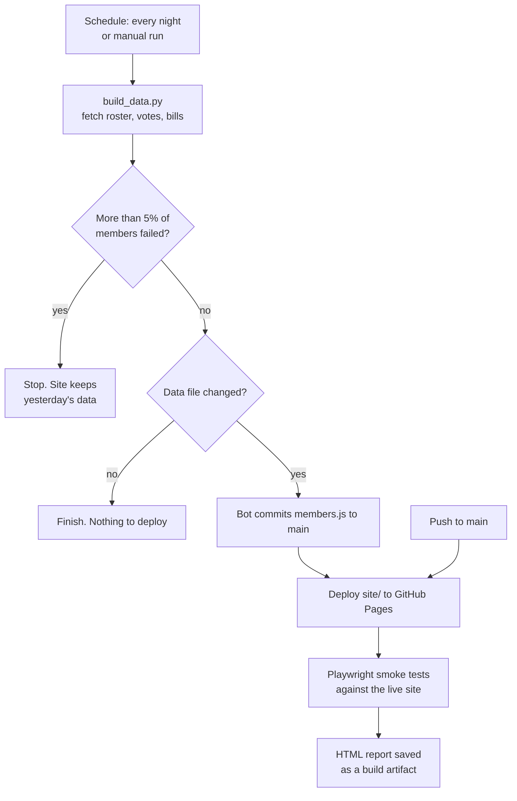

# Case study: a public website that updates, deploys and tests itself

**Live site:** [congressreportcard.org](https://congressreportcard.org) ·
**Code:** [github.com/dburch19142/congress-report-card](https://github.com/dburch19142/congress-report-card) ·
**Pipeline runs:** [Actions](https://github.com/dburch19142/congress-report-card/actions)

## Summary

Congress Report Card gives every current U.S. Representative and Senator a letter grade based on
vote attendance, bills written and bills supported. The data changes every day Congress is in
session, so a site that depends on me to refresh it would go stale.

I automated the whole path from raw data to a verified release. Every night a pipeline pulls
fresh data from three public sources, rebuilds the data file, publishes the site and runs
cross-browser smoke tests against the live result. I do nothing by hand.

| | |
|---|---|
| Manual steps per release | 0 |
| Scheduled nightly runs since launch (Sept 24 – Oct 1, 2026) | 8 of 8 succeeded |
| API calls per full data build | about 1,500 |
| Smoke checks per deploy | 33 (11 tests × Chromium, Firefox, WebKit) |
| Smoke test job time | about 90 seconds, including browser install |
| Deploy time | about 16 seconds |

## How the pipeline works

Three GitHub Actions workflows do the work:

- **Nightly data update** (`update-data.yml`) runs the Python build, commits the data file if it
  changed, deploys and then calls the smoke tests.
- **Deploy** (`pages.yml`) publishes the site on every push to `main` and calls the same smoke
  tests.
- **Smoke tests** (`smoke-tests.yml`) is a reusable workflow, so both deploy paths share one
  definition of "the site works". It can also be run by hand.

## Design decisions

**Fail safe, not fail loud.** The build talks to three outside services about 1,500 times. Each
request retries with a growing wait on rate limits and server errors. If more than 5% of members
still fail to load, the script exits without writing output, and the site keeps the previous
day's data. A partial outage upstream never reaches visitors.

**Only deploy when something changed.** The update job compares the new data file with the
committed one. If they match, the deploy and test jobs are skipped.

**One retry, with evidence.** In CI each test gets one retry, and Playwright records a trace on
that retry. A flaky failure leaves a trace I can replay; a real failure fails twice. The HTML
report is kept for 14 days.

**Tests that follow the data.** The member list changes as seats are filled and vacated, so the
tests never hard-code counts. They read the site's own data and check that the page agrees with
it: "the Senate filter shows as many cards as there are senators in the data."

**Least privilege.** Each job declares only the permissions it needs. The test job can read the
repository and nothing else. The API key lives in a repository secret.

**No overlapping runs.** Concurrency groups stop two data updates or two deploys from running
at once.

## What the smoke tests cover

The suite began as 11 recorded Selenium IDE tests. I rewrote them in Playwright to get
auto-waiting, parallel runs across three browser engines and trace files. The Selenium IDE
project is still in the repository for comparison.

| Area | What is checked |
|---|---|
| Page load | Title, default filters, every member listed |
| Search | Name, state name, state abbreviation, no-match case |
| Filters | Chamber, state and party, alone and combined |
| Sorting | Highest grade, lowest grade, most votes missed, name |
| Grade chart | Clicking a letter filters the list; bar totals match the list |
| Member card | Opens, closes three ways, deep links, bad deep links |
| Grading weights | Sliders change grades, persist across reload, reset |
| Data integrity | Member counts in range, no duplicate IDs, vote counts consistent, links point to congress.gov |
| Data freshness | The published data is less than 3 days old |
| Phone layout | No sideways scrolling at 390 px; the card fits the screen |

The data integrity and freshness tests check the pipeline's output as well as the page. A bad
build that produces two senators too many for a state fails the suite even though the page
renders.

## Problems worth noting

**The nightly commit did not deploy.** My first design had the nightly job push the new data
and relied on the push-triggered deploy workflow to publish it. Nothing deployed. GitHub does
not start workflows from pushes made with the built-in Actions token, to prevent loops. I moved
the deploy into the nightly workflow itself, with the checkout pinned to `main` so it includes
the commit made one job earlier.

**A hash-only navigation did not reload the page.** The deep-link test opened
`/#MEMBER_ID` while already on the site, which changes the hash without rerunning the startup
code. The test now adds a query string to force a full load, which is what a visitor following
a shared link gets.

**Name sorting depends on where the comparison runs.** Node and a browser can order the same
names differently. The sort check runs inside the browser so the test and the site use the same
collation.

## Limits and next steps

- **Tests run after the deploy, not before.** They detect a bad release within two minutes but
  do not block it. The config already accepts a `BASE_URL`, so the next step is to run the suite
  against a local copy of the build before publishing.
- **Scheduled runs start late.** The job is set for 09:00 UTC, but GitHub has started it
  between 13:37 and 17:22 UTC. That is acceptable for daily data.
- **Failures notify only through GitHub's default email.** I plan to have a failed nightly run
  open an issue automatically.
- **The smoke tests joined the pipeline on October 1, 2026.** The run history for them is
  short so far.

## Tools

GitHub Actions · Playwright (JavaScript) · Selenium IDE · Python 3.12 (standard library only) ·
GitHub Pages · Congress.gov API · Voteview · unitedstates/congress-legislators
